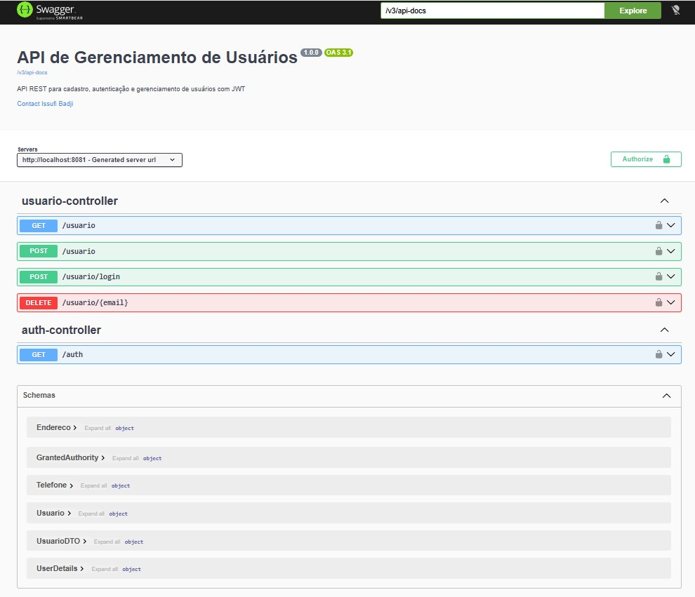
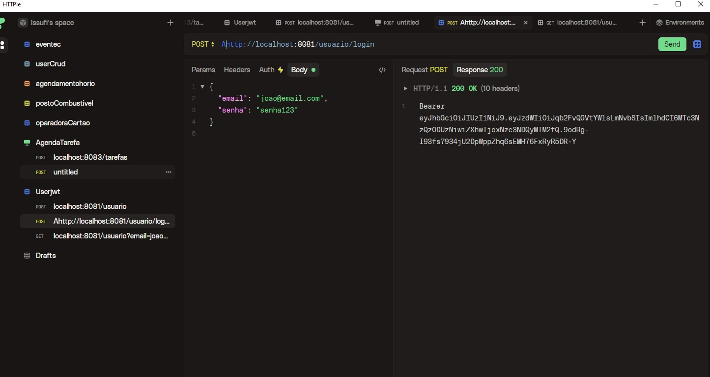
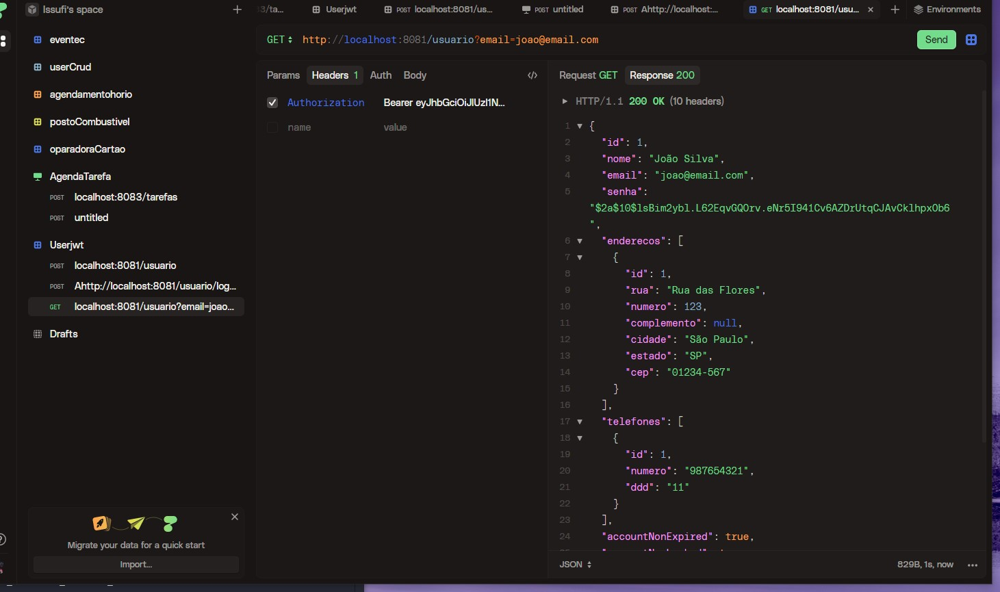

# Aprendendo Spring

API REST de gerenciamento de usuários com autenticação JWT, construída com Spring Boot 4 e Java 26.

## Visão Geral

O projeto implementa um sistema completo de cadastro e autenticação de usuários, incluindo endereços e telefones associados. A segurança é baseada em tokens JWT com Spring Security no modo stateless.

## Tecnologias

| Tecnologia | Versão |
|---|---|
| Java | 26 |
| Spring Boot | 4.0.6 |
| Spring Security | 7.x |
| Spring Data JPA | 7.x |
| PostgreSQL | 15+ |
| Lombok | 1.18.36 |
| JJWT | 0.13.0 |

## Pré-requisitos

- JDK 26+
- Maven 3.9+
- PostgreSQL 15+ rodando em `localhost:5432`

## Configuração do Banco de Dados

```sql
CREATE DATABASE db_usuario;
```

Configure as credenciais em [src/main/resources/application.properties](src/main/resources/application.properties):

```properties
spring.datasource.url=jdbc:postgresql://localhost:5432/db_usuario
spring.datasource.username=postgres
spring.datasource.password=1234
```

## Como Executar

```bash
# Clonar o repositório
git clone <url-do-repositorio>
cd aprendendo-spring

# Compilar e executar
mvn spring-boot:run
```

A API estará disponível em `http://localhost:8081`.

## Endpoints Principais

| Método | Endpoint | Autenticação | Descrição |
|---|---|---|---|
| POST | `/usuario` | Não | Cadastrar usuário |
| POST | `/usuario/login` | Não | Login (retorna JWT) |
| GET | `/usuario?email=` | JWT | Buscar usuário por e-mail |
| DELETE | `/usuario/{email}` | JWT | Deletar usuário |
| GET | `/auth?email=` | Não | Buscar detalhes do usuário |

### Exemplo de Cadastro

```bash
curl -X POST http://localhost:8081/usuario \
  -H "Content-Type: application/json" \
  -d '{
    "nome": "João Silva",
    "email": "joao@email.com",
    "senha": "senha123",
    "enderecos": [{
      "rua": "Rua das Flores",
      "numero": 123,
      "cidade": "São Paulo",
      "estado": "SP",
      "cep": "01234-567"
    }],
    "telefones": [{
      "ddd": "11",
      "numero": "987654321"
    }]
  }'
```

### Exemplo de Login

```bash
curl -X POST http://localhost:8081/usuario/login \
  -H "Content-Type: application/json" \
  -d '{"email": "joao@email.com", "senha": "senha123"}'
```

A resposta retorna o token JWT. Use-o nos endpoints protegidos:

```bash
curl -X GET "http://localhost:8081/usuario?email=joao@email.com" \
  -H "Authorization: Bearer <seu-token>"
```

## Demos

### Swagger UI



### Requisições HTTP





## Documentação de Arquitetura

Consulte o diretório [docs/](docs/) para documentação detalhada:

- [Arquitetura Geral](docs/arquitetura-geral.md)
- [Segurança e JWT](docs/seguranca.md)
- [API Endpoints](docs/api-endpoints.md)
- [Modelo de Dados](docs/modelo-dados.md)

## Estrutura do Projeto

```
src/main/java/com/issufibadji/aprendendospring/
├── AprendendoSpringApplication.java
├── business/
│   └── UsuarioService.java
├── controller/
│   ├── AuthController.java
│   ├── UsuarioController.java
│   └── dtos/
│       └── UsuarioDTO.java
└── infrastructure/
    ├── entity/
    │   ├── Usuario.java
    │   ├── Endereco.java
    │   └── Telefone.java
    ├── repository/
    │   ├── UsuarioRepository.java
    │   ├── EnderecoRepository.java
    │   └── TelefoneRepository.java
    ├── exceptions/
    │   ├── ConflictException.java
    │   └── ResourceNotFoundException.java
    └── security/
        ├── JwtUtil.java
        ├── JwtRequestFilter.java
        ├── SecurityConfig.java
        └── UserDetailsServiceImpl.java
```
